# Labor 02

## Installation and Configuration  

Node-RED was deployed as a Docker container using the official Docker image, with a Docker Compose file simplifying the setup and management. Here's how the Docker Compose file is structured:

### Docker Compose Configuration

```yml
services:
  app:
    image: nodered/node-red:latest
    ports:
      - "1880:1880"  # Exposing Node-RED on port 1880
    volumes:
      - ./data:/data   # Persisting data in the ./data directory
      - ./cert:/cert   # Mounting certificates for secure communication
    env_file:
      - .env  # Loading environment variables from the .env file
```

### Environment File

The `.env` file contains sensitive information that should not be publicly exposed. It is used to securely store environment variables, such as credentials and API keys. Here’s an example of how the `.env` file looks:

```
RED_ADMIN_PWD=SECURE_PASSWORD  # Admin password, encrypted
RED_SECRET=A_BIG_SECRET                   # Secret key for Node-RED
RED_WEATHER_API_KEY=MY_API_KEY_FROM_WEATHERAPI_COM  # API key for Weather API
```

By using Docker Compose and environment files, sensitive data such as passwords and API keys are kept secure and separate from the codebase, which is crucial for maintaining security in production environments.

### Securing the Connection  

Initially, a JavaScript script was created to generate a self-signed certificate with all IPs and hostnames included, avoiding certificate mismatches. However, self-signed certificates cause browsers to flag the connection as insecure unless the certificate is manually added to each machine's certificate store.

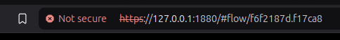

To resolve this issue, a fully signed certificate was used instead. The Node-RED server runs on a public server, but access is restricted to a VPN, ensuring secure connectivity. With this setup, the domain name resolves correctly, and browsers no longer display certificate errors.

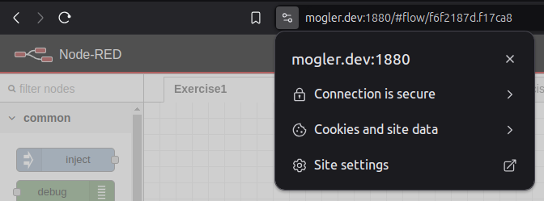

The Code for creating self signed certificate is here available: [https://github.com/moglerdev/ain_ubiquitous_computing/blob/main/Lab2/index.js](https://github.com/moglerdev/ain_ubiquitous_computing/blob/main/Lab2/index.js)

## Exercise 1: Hello World

<div style="display: flex; gap: 10px; align-items: center;">
  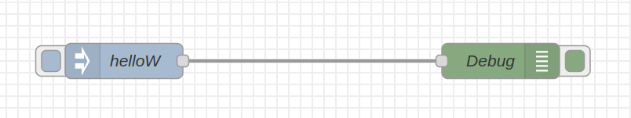
  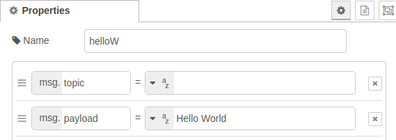
</div>

The first assignment was to learn the basics of Node-RED. It was a simple task involving an inject node and a debug node. The inject node sends a message object with the payload "Hello World" to the debug node. With this toolset, it is possible to debug the flow and, for example, inspect the payload of the message after specific nodes.

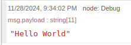

## Exercise 2: Change World to Mars

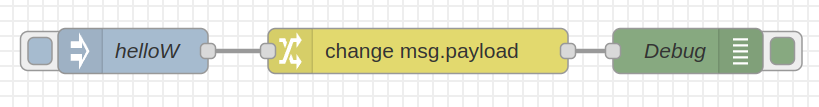

In this chapter, the task was to replace the word "World" with "Mars," which requires the use of the change node. The change node can access the `msg`, `flow`, or `global` objects and modify their properties based on their names, even at deeper levels using dot notation. It supports four methods: **change**, **set**, **delete**, and **move**. 

- **Change**: Searches for a specific value (e.g., a string) in the payload and replaces it with another value, such as replacing "World" with "Mars" in this task. It can also work with other data types.  
- **Set**: Assigns a value (e.g., an object or string) directly to a specified property.  
- **Delete**: Removes the specified property.  
- **Move**: Transfers a property to another object, such as moving a `msg` property to the `flow` or `global` object.

<div style="display: flex; gap: 10px; align-items: center;">
  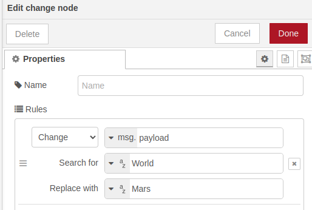
  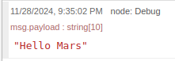
</div>

To test the change node, the final node in the flow is a debug node.

## Exercise 3: Work with CSV Data from the Web

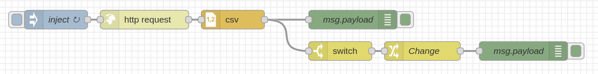

The USGS website provides access to the latest significant earthquakes of the current month. To fetch this data, the request node can be used with a specific URL. The request node supports various HTTP methods and custom methods if needed.  

Key configurations include:  
- **URL**: Specifies the endpoint to send the request to.  
- **Payload**: Determines how the payload from the previous node is used: ignored (default), appended as URL search parameters (e.g., `?foo=bar&moo=coo`), or sent as the HTTP body.  
- **Secure Connection**: Enabling SSL/TLS adds a field to adjust TLS settings, e.g., for self-signed certificates.  
- **Authentication**: Supports `basic`, `digest`, and `bearer` methods for restricted APIs.  
- **Keep-Alive**: Keeps the connection open to improve latency.  
- **Custom Proxy**: Allows using a proxy server.  
- **Non-OK Responses**: These are sent only to a catch node to avoid undefined behaviors.  
- **Strict HTTP Parsing**: Disabling this helps with non-standard HTTP responses, typically from older servers, but may introduce issues.  
- **Return Type**: Specifies the response format, e.g., string (UTF-8), binary buffer (image), or JSON.  
- **Headers**: Allows adding custom headers for the request.  

The USGS server responds with data in CSV format. To process it, a CSV parser node is used, converting the string into an object in the `msg.payload`. Customization options include:  
- **Separator**: Default is a comma, but it can be set to other delimiters (e.g., semicolon).  
- **Header Row**: Checking `first row contains column names` ensures proper parsing.  
- **Output Mode**: Can send each row as a separate message or the entire data as an array. For this task, each row is sent as an individual message.  

In the next step, the parsed data is sent to a debug node for logging and to a switch node. The switch node checks whether the `mag` property in the payload is greater than or equal to 6. If true, a change node updates the payload to "panic," which is then printed using another debug node.

This flow is triggered every 5 minutes by an inject node.

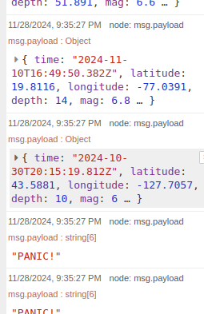

## Exercise 4: Create a Clock with a Dashboard

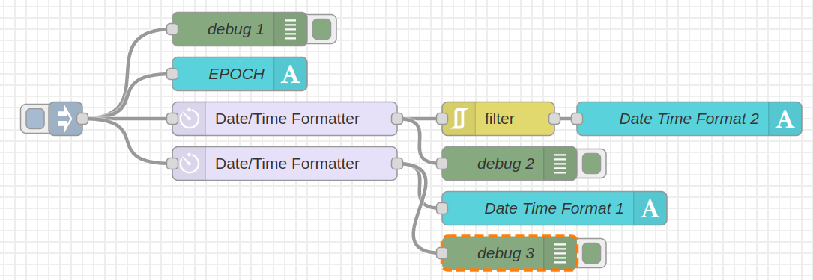

Node-RED does not include a dashboard feature by default. To enable this, the `@flowfuse/node-red-dashboard` package is required, which introduces new nodes for displaying data on a dashboard. In this task, the goal was to display the current date and time. Using the `node-red-contrib-moment` package simplifies working with dates and times by adding specialized nodes. Note that installing packages may automatically include required dependencies.

The flow starts with an inject node configured to fire every second and then splits into four lanes:  

1. **Epoch Logging**: The inject node’s payload, the epoch (time in milliseconds since 01/01/1970 00:00), is logged to the console.  

2. **Epoch to Dashboard**:  
   - A text node is used to display the epoch on the dashboard.  
   - For this, the dashboard layout must include a configured page with a group (set up via the FlowFuse package).  
   - The text node is configured with a label, group, and a binding to the payload.  

3. **Formatted Date/Time with Filtering**:  
   - The epoch is formatted to `DD/MM/YY HH:mm` (European standard with a 24-hour clock) using the **Date/Time Formatter** node from the Moment package.  
   - The formatted payload is logged to the console and then sent to a filter node.  
   - The filter ensures the flow continues only when the formatted value changes (every minute), blocking unnecessary updates caused by the inject node firing every second.  
   - After filtering, the payload is displayed on the dashboard via a text node.  

4. **Detailed Date/Time**:  
   - The epoch is formatted to `dddd, MMMM Do YYYY, h:mm:ss a` (e.g., "Monday, September 25th 2024, 5:42:17 pm").  
   - This includes the day of the week, full month name, day, year, and time in 12-hour format with `am/pm`.  
   - Since the formatted value includes seconds, no filter node is needed, as it updates every second.  
   - The formatted payload is logged to the console and displayed on the dashboard via another text node.

<div style="display: flex; gap: 10px; align-items: center;">
  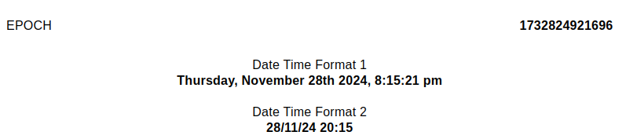
  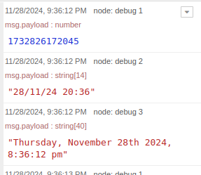
</div>

This setup effectively prints both raw and formatted timestamps to the console and dashboard, showcasing different levels of detail.

## Exercise 5: Print Weather information to a Dashboard

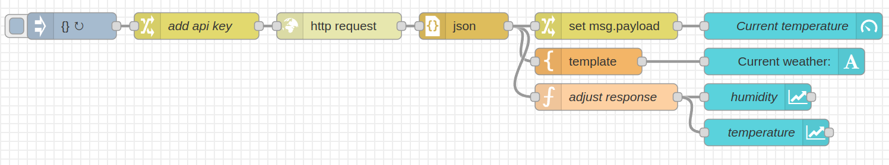

The last assignment involved fetching weather data from an API and displaying it on the dashboard. The `weatherapi.com` API was used, and the API key was securely stored as an environment variable (`$RED_WEATHER_API_KEY`) to avoid exposing it in the flow. 

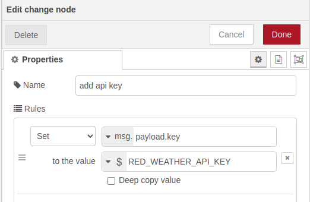

### Steps:  

1. **Fetching Weather Data**:  
   - A change node sets the `key` property in the payload using the environment variable `$RED_WEATHER_API_KEY`.  
   - The request node sends a request to `https://api.weatherapi.com/v1/current.json?q=Konstanz`, appending the payload (API key) to the URL.  
   - The response, in JSON format, is parsed into an object.  

2. **Displaying Temperature as a Gauge**:  
   - A change node sets `msg.payload` to `msg.payload.current.temp_c`.  
   - The gauge node displays the temperature, configured with a range of -20 to 40°C and 10 gradient colors.  

3. **Displaying Weather in Text Form**:  
   - A template node uses Mustache syntax to format the weather data into readable text.  
   - The formatted text is displayed using a text node.  
   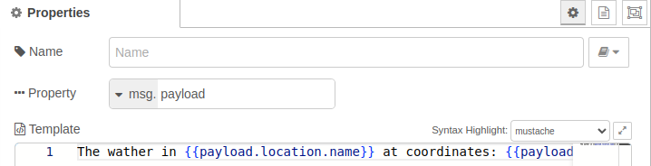

4. **Humidity and Temperature Charts**:  
   - A function node extracts key values from the weather data:  
     ```js
     const value = msg.payload.current;
     return {
         payload: {
             time: new Date(),
             humidity: value.humidity,
             temp: value.temp_c
         }
     };
     ```  
   - The function node creates a payload containing the current time, humidity, and temperature in Celsius.  
   - Two chart nodes receive this data:  
     - One plots humidity (`y` = `humidity`).  
     - The other plots temperature (`y` = `temp`).  
   - Both charts use a linear interpolation, append new data, and format the X-axis in 24-hour time.

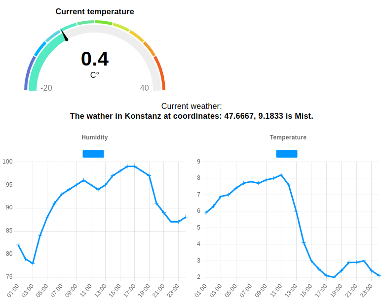   

This flow displays real-time weather information in multiple formats, updating dynamically for a smooth user experience.
