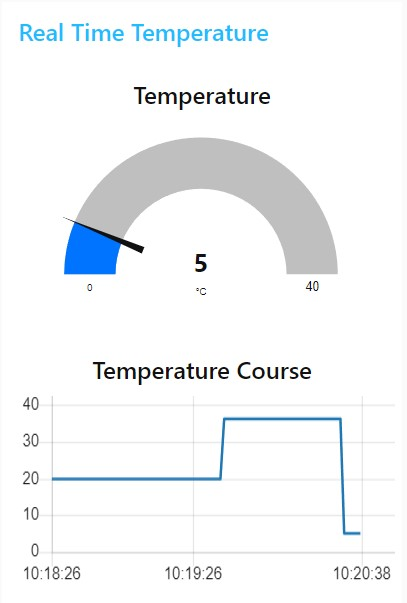

# Ubiquitous Computing: Lab 3

## Exercise 1: Building an Arduino-Node-Red Circuit for LED and Button Synchronization

### Task 1: Physical Button with Node Red Dashboard


In this lab, the objective was to create a system combining an Arduino and Node-RED to control an LED. For simplicity, the Arduino’s built-in LED was used, and a physical button was added to toggle the LED on and off. Additionally, a web-based dashboard in Node-RED allowed the LED to be controlled remotely via the serial interface.


The setup involved configuring the Arduino to respond to both the physical button and a virtual button on the Node-RED dashboard. A visual indicator, represented as a light bulb icon in the dashboard, displayed the LED’s current state. This status was updated in real-time by using Node-RED’s `Serial In` node, which listened for updates sent by the Arduino over the serial connection.

To enable communication between the Arduino and Node-RED, the serial bus had to be properly configured. On Windows, the Arduino connects through `COM_` devices, while on Linux, it uses `/dev/ttyUSB_`, with the underscore replaced by the port number. The baud rate was set to `9600` to match the data transmission speed of the Arduino, ensuring smooth communication between the two systems.


The dashboard displays a light bulb and a switch to turn it on and off. The issue arises because the virtual switch and the physical button are not synchronized. As a result, when you press the button, both the virtual and physical lights turn on, but the switch does not reflect the correct state. Consequently, when the switch is pressed again, nothing happens, and vice versa. This occurs because when the button is pressed, the signal from the serial port only updates the light bulb and not the switch.

<div style="display: flex; justify-content: space-between;">
  
  
  
</div>


### Task 2: Synchronized Node-RED and Arduino Flow


In the previous task, there is an issue with synchronization between the virtual switch and the physical button. To fix this issue, the updates from the serial port must also update the state of the switch. This ensures that both the virtual switch and the physical button are synchronized. As a result, there will only be one flow left, eliminating the discrepancy between the two.

```c
#define BUTTON_PIN 0x2
#define LED_PIN 0xD

int prevState = 0;
```

The Arduino code began with defining constants for the button and LED pins. The button was connected to pin `D2`, represented by the address `0x2`, while the built-in LED was accessed at address `0xD`. A variable, `prevState`, was introduced to track the previous state of the button. This was crucial to ensure that data was sent over the serial port only when the button’s state changed, reducing unnecessary communication.

```c
void setup() {
  pinMode(LED_PIN, OUTPUT);
  pinMode(BUTTON_PIN, INPUT_PULLUP);
  Serial.begin(9600);
}
```

In the `setup` function, the LED pin was configured as an output, allowing it to be turned on or off by writing a digital signal to it. The button pin was set as an input with a pull-up resistor, which ensured the pin remained in a high state unless the button actively pulled it low. Serial communication was also initialized with a baud rate of `9600`, setting up the Arduino to transmit and receive data at the appropriate speed.

```c
void loop() {
  int buttonState = digitalRead(BUTTON_PIN);

  if (buttonState != prevState) {
    prevState = buttonState;
    Serial.println(buttonState);
    digitalWrite(LED_PIN, buttonState);
  }
  // ...
```

The `loop` function began by reading the current state of the button and comparing it to the previous state stored in `prevState`. If the state had changed, the new state was written to the serial port, and the LED was updated to reflect the button’s state. This mechanism ensured that the LED’s behavior remained consistent with the button’s input, whether pressed or released.

```c
  // ...
  if (Serial.available() > 0) {
    char command = Serial.read();
    if (command == '1') {
      digitalWrite(LED_PIN, HIGH);
    } else if (command == '0') {
      digitalWrite(LED_PIN, LOW);
    }
  }
} // END void loop();
```

The second part of the `loop` function handled incoming commands from Node-RED over the serial connection. If data was available, a single character was read and interpreted as a command. A `'1'` turned the LED on by setting the pin to high, while a `'0'` turned it off by setting the pin to low. This allowed the LED to be controlled not only by the physical button but also remotely through the Node-RED dashboard.

By combining the physical button, serial communication, and Node-RED’s interface, this exercise demonstrated how to create a responsive system for LED control. The result was a functional and interactive circuit that integrated hardware and software seamlessly, showcasing the power of ubiquitous computing in action.

## Exercise 2: Push measured Temperature to Node-RED


<div style="display: flex; justify-content: space-between;">
  
  
  
</div>

```c
#include <WiFiNINA.h>
#include <Arduino_LSM6DSOX.h>

void setup() {
  Serial.begin(9600);
  if(!IMU.begin()) 
    Serial.println("IMU error");
}

void loop() {
  int temp_deg = 0;
  IMU.readTemperature(temp_deg);
  Serial.println(temp_deg);
  delay(1000);
}
```

## Exercise 3: Publish measured Temperature to MQTT


