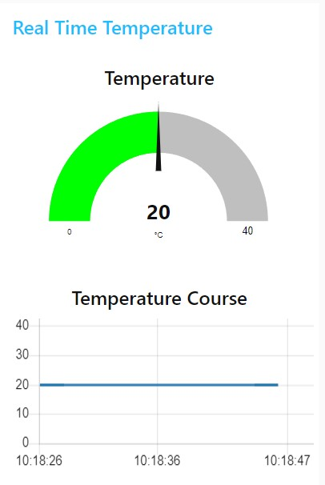
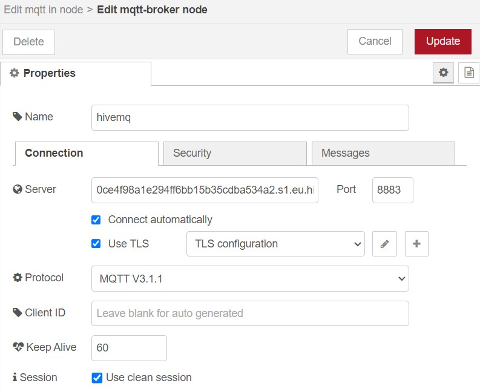

# Ubiquitous Computing: Lab 3

## Exercise 1: Building an Arduino-Node-Red Circuit for LED and Button Synchronization

### Task 1: Physical Button with Node Red Dashboard


In this lab, the objective was to create a system combining an Arduino and Node-RED to control an LED. For simplicity, the Arduino’s built-in LED was used, and a physical button was added to toggle the LED on and off. Additionally, a web-based dashboard in Node-RED allowed the LED to be controlled remotely via the serial interface.


The setup involved configuring the Arduino to respond to both the physical button and a virtual button on the Node-RED dashboard. A visual indicator, represented as a light bulb icon in the dashboard, displayed the LED’s current state. This status was updated in real-time by using Node-RED’s `Serial In` node, which listened for updates sent by the Arduino over the serial connection.

To enable communication between the Arduino and Node-RED, the serial bus had to be properly configured. On Windows, the Arduino connects through `COM_` devices, while on Linux, it uses `/dev/ttyUSB_`, with the underscore replaced by the port number. The baud rate was set to `9600` to match the data transmission speed of the Arduino, ensuring smooth communication between the two systems.


The dashboard displays a light bulb and a switch to turn it on and off. The issue arises because the virtual switch and the physical button are not synchronized. As a result, when you press the button, both the virtual and physical lights turn on, but the switch does not reflect the correct state. Consequently, when the switch is pressed again, nothing happens, and vice versa. This occurs because when the button is pressed, the signal from the serial port only updates the light bulb and not the switch.

<div style="display: flex; justify-content: space-between;">
  
  
  
</div>


### Task 2: Synchronized Node-RED and Arduino Flow


In the previous task, there is an issue with synchronization between the virtual switch and the physical button. To fix this issue, the updates from the serial port must also update the state of the switch. This ensures that both the virtual switch and the physical button are synchronized. As a result, there will only be one flow left, eliminating the discrepancy between the two.

```c
#define BUTTON_PIN 0x2
#define LED_PIN 0xD

int prevState = 0;
```

The Arduino code began with defining constants for the button and LED pins. The button was connected to pin `D2`, represented by the address `0x2`, while the built-in LED was accessed at address `0xD`. A variable, `prevState`, was introduced to track the previous state of the button. This was crucial to ensure that data was sent over the serial port only when the button’s state changed, reducing unnecessary communication.

```c
void setup() {
  pinMode(LED_PIN, OUTPUT);
  pinMode(BUTTON_PIN, INPUT_PULLUP);
  Serial.begin(9600);
}
```

In the `setup` function, the LED pin was configured as an output, allowing it to be turned on or off by writing a digital signal to it. The button pin was set as an input with a pull-up resistor, which ensured the pin remained in a high state unless the button actively pulled it low. Serial communication was also initialized with a baud rate of `9600`, setting up the Arduino to transmit and receive data at the appropriate speed.

```c
void loop() {
  int buttonState = digitalRead(BUTTON_PIN);

  if (buttonState != prevState) {
    prevState = buttonState;
    Serial.println(buttonState);
    digitalWrite(LED_PIN, buttonState);
  }
  // ...
```

The `loop` function began by reading the current state of the button and comparing it to the previous state stored in `prevState`. If the state had changed, the new state was written to the serial port, and the LED was updated to reflect the button’s state. This mechanism ensured that the LED’s behavior remained consistent with the button’s input, whether pressed or released.

```c
  // ...
  if (Serial.available() > 0) {
    char command = Serial.read();
    if (command == '1') {
      digitalWrite(LED_PIN, HIGH);
    } else if (command == '0') {
      digitalWrite(LED_PIN, LOW);
    }
  }
} // END void loop();
```

The second part of the `loop` function handled incoming commands from Node-RED over the serial connection. If data was available, a single character was read and interpreted as a command. A `'1'` turned the LED on by setting the pin to high, while a `'0'` turned it off by setting the pin to low. This allowed the LED to be controlled not only by the physical button but also remotely through the Node-RED dashboard.

By combining the physical button, serial communication, and Node-RED’s interface, this exercise demonstrated how to create a responsive system for LED control. The result was a functional and interactive circuit that integrated hardware and software seamlessly, showcasing the power of ubiquitous computing in action.

### Problems and Obstacles

Node-RED is running in a Docker container, which means it does not have direct access to the serial port (USB) where the Arduino is connected. To enable access, the `docker-compose` file from the previous task needed to be updated as follows:

```yml
services:
  app:
    image: nodered/node-red:latest
    ports:
      - "1880:1880"
    volumes:
      - node_red_data:/data
    env_file:
      - .env
    # Added to enable serial port access
    devices:
      - "/dev/ttyACM0:/dev/ttyACM0"
    user: root
    # End of new configuration
volumes:
  node_red_data:
```

The update includes piping the device/port to the container using the `devices` configuration. This maps the host's `/dev/ttyACM0` device to the container, making it accessible with the same path and name.

By default, the Node-RED instance in the container does not run as the root user. This caused some issues, but the solution was straightforward: override the user to `root` in the `docker-compose` file. 

Running Node-RED as `root` is not recommended in production environments. For enhanced security, the Docker image should be modified to include the running user in the system group `dialout`, granting access to serial ports without requiring root privileges. This adjustment reduces security risks while maintaining functionality.

## Exercise 2: Push measured Temperature to Node-RED

In this exercise, the integrated IMU chip is used to measure the temperature and display it on a Node-RED web dashboard. To achieve this, a new Arduino code is required.

```c
#include <WiFiNINA.h>
#include <Arduino_LSM6DSOX.h>

void setup() {
  Serial.begin(9600);
  if(!IMU.begin()) 
    Serial.println("IMU error");
}

void loop() {
  int temp_deg = 0;
  IMU.readTemperature(temp_deg);
  Serial.println(temp_deg);
  delay(1000);
}
```

In the `setup` function, the serial communication is initialized with a baud rate of `9600`. After that, the IMU is initialized and checked for successful setup. If the initialization fails, an error message is printed to the serial port.

In the `loop` function, the current temperature is read and stored in a local variable, then printed to the serial output. To minimize the frequency of writes to the serial port, a delay of 1 second is introduced, ensuring the current measured value is printed only once per second.


In Node-RED, the serial node receives the temperature data from the Arduino and outputs it to the debug console. This data is also sent to a gauge node to display the current temperature in real-time and a chart node to visualize the historical temperature trends.

<div style="display: flex; justify-content: space-between;">
  
  
  
</div>

## Exercise 3: Publish Measured Temperature to MQTT

Building on the previous exercise, the system is enhanced by integrating the MQTT protocol to enable a cloud-based dashboard. For this, we use **Datacake** to create an easy-to-use dashboard. To allow Datacake to access the measured values, the temperature data must be published via MQTT.

To provide a simple and reliable MQTT service, **HiveMQ Cloud** is used. This platform allows publishing and subscribing to MQTT topics over a secure connection using TLS.

Both Datacake and HiveMQ Cloud require user accounts, but neither requires credit card information. This is convenient as it ensures no unexpected charges can occur.

### HiveMQ Setup

<div style="display: flex; justify-content: space-between;">
  
  
</div>

In HiveMQ, a new (free) cluster is created using the "Create New Cluster" option in the HiveMQ dashboard, selecting the **free serverless version**. 

To enable publishing and subscribing to the service, new credentials are added. For simplicity in this exercise, security was not a focus, so a single credential with full permissions (`PUBLISH_SUBSCRIBE`) was created and used for all operations.



To establish an MQTT connection in Node-RED, an MQTT broker configuration is required. The **server URL** and **port** are copied from the HiveMQ dashboard. 

For a secure connection, a TLS configuration is added to enable end-to-end encryption. No specific certificate is uploaded; instead, the configuration is set to verify the server's certificate. This works because HiveMQ uses a trusted certificate authority, not a self-signed certificate.

Authentication is handled in the **Security** tab of the MQTT configuration, where the previously created **username** and **password** are entered. 

### Publishing the Data with MQTT


First, the serial data is read using the **serial out node** in Node-RED. To minimize unnecessary messages, the data is filtered so that only changes in the temperature value trigger an action. When a new value is detected, it is published to the MQTT topic `TEMPERATURE`.

### Setting Up DataCake

In DataCake, the first step is to create a UI, which requires the creation of a device. DataCake offers a variety of device types, and for this task, the `API` device type was chosen to subscribe to MQTT topics.

After creating the device, some configuration steps are necessary. You need to set up a new MQTT server to allow DataCake to connect. The same connection values and credentials used in Node-RED were applied here. However, DataCake only requires subscription permissions. For added security in production environments, it's recommended to use separate credentials from Node-RED with only subscription permissions.

```js
function Decoder(topic, payload) {
    var temperature_c = payload;
    var temperature_f = (payload * 9/5) + 32;
    return [
        {
            device: "088b19d5-82f9-4643-830a-018b49ce53a6",
            field: "TEMPERATURE",
            value: temperature_c
        },
        {
            device: "088b19d5-82f9-4643-830a-018b49ce53a6",
            field: "TEMPERATURE_F",
            value: temperature_f
        }
    ];
}
```

To ensure DataCake can process the data, an MQTT Uplink Decoder is required. This allows subscribing to specific topics (or all topics) and sending either the raw or transformed data to a specific device. A JavaScript function called `Decoder` is created, which takes two parameters: the current topic and the payload. In this case, the payload is the only relevant part, as it represents the numerical value of the temperature measured by the Arduino. The temperature is initially in Celsius, and for demonstration purposes, the function also calculates the Fahrenheit equivalent.

The function returns an array of objects. Each object specifies the `device` (indicating which device the value is sent to), the `field` (which is similar to the topic but is used only by DataCake), and the `value` (which represents the current temperature value).


To use the values, two `Fields` are added: one for the temperature in Celsius and another for Fahrenheit. Both fields are of the `float` type, with the unit set to `°C` for Celsius and `°F` for Fahrenheit, respectively. This allows DataCake to handle and display the temperature values in both units.

### Visualizing Data with DataCake

<div style="display: flex; justify-content: space-between;">
  
  <div style="max-width: 44%;">
    
  </div>
</div>

A new Dashboard is added to DataCake to provide a user-friendly interface for visualizing the temperature values. The dashboard is organized into three rows. The first row displays a table that shows the maximum, minimum, and current temperature in Celsius, giving an overview of the temperature range and the latest reading. The second row features a gauge-like interface to display the current temperature in Celsius, while a chart on the right side shows the historical temperature data over time. The third row is similar to the second but shows the temperature in Fahrenheit, with a gauge and chart setup to allow users to monitor the temperature in both Celsius and Fahrenheit. This layout makes it easy to track and compare temperature values in a clear and intuitive way.

### Problems

An issue arose where the exported flow did not include the credentials, resulting in them being empty after importing into another Node-RED instance. Node-RED threw an error, unable to connect to the MQTT server, but it wasn't immediately clear that the problem was related to authentication. It took some time to identify the root cause.

The issue stemmed from the limitations of the free services provided by HiveMQ and DataCake. HiveMQ is restricted by the number of connections and the amount of transferred data, while DataCake limits the number of messages that can be sent via MQTT. During the initial stages of development, data was being transmitted every second, but DataCake only allows 500 messages per day. This limitation halted the development process until the message counter was reset. To resolve this, a filter was implemented in Node-RED to only send data when the values changed.

Additionally, DataCake encountered an issue subscribing to the `TEMPERATURE` topic. Due to time constraints, the workaround was to have the DataCake MQTT uplink subscribe to all topics. This was acceptable for the exercise, as there was only one topic. However, in production environments, this approach could lead to undefined behaviors and should be further investigated in the future.
